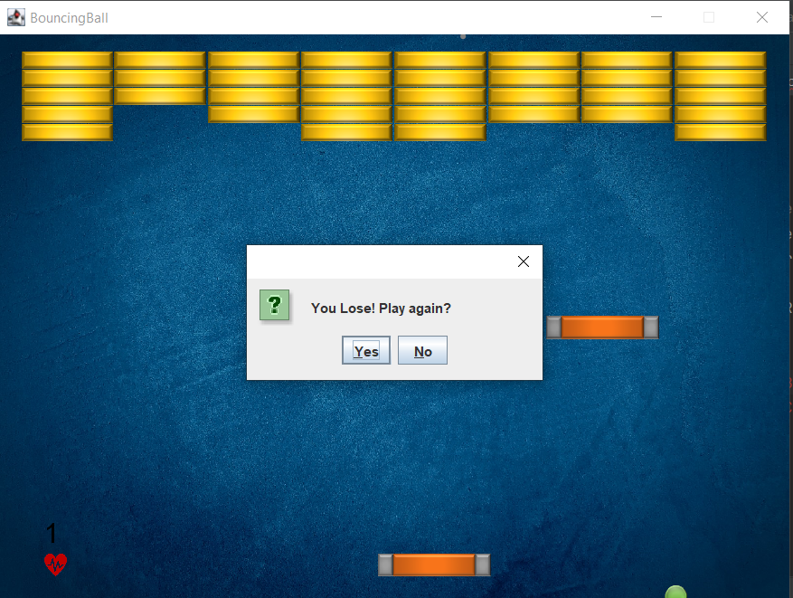

## Classic Bricker Game

### Its how the game look like:

### BrickerGameManager
We create all the objects required for the initialization of the game. Including strategy for every brick.

The method initializeGame calls methods with the template of "create XXX" to create XXX objects.

In the update method we deal with disposing non relevant objects and check for the end of the game.

If we lost life - we reset some general variables to flawless start.

### Strategies
We have class for every strategy, including double behaviour for future implements.

We have the decorator of remove brick strategy that holds object of remove strategy brick class.

I chose to add strategy of change game speed. 

For that I made another three classes. 

One for the strategy herself - ChangeGameSpeedStrategy, two for general object of statusChanger and three GameSpeedChanger that inherit from
statusChanger class. 

The ChangeGameSpeedStrategy has similar pubic class like ChangeCamera Strategy called
"changeGameSpeed" that is be called from the objects of changeGameSpeed after they made a collision with a paddle.
(either of them)

### BrickStrategyFactory 
Return random strategy after make each strategy accordingly to random choice.
we include the random choice of we get third behaviour and which of the behaviour is the third.

### ChangeCameraStrategy 
The instructions make her behaviour after a collision of a ball, any ball,
in the brick that holds this startegy automathically and turn the change off via the public method turnOffCameraChange.

### AddPaddleStrategy 
The class uses the public flag called isInstantiated from the MockPaddle class to know if there is
already an extre padddle and if there isn't we make a new paddle.

### ChangeGameSpeedStrategy 
The class used the objects of the class GameSpeedChanger that inherit from StatusChanger.
I use the method changeGameSpeed that the onCollision of GameSpeedChanger instances call.
Status Changer simple cover the basic movement of that kind of objects. (I made him to furue implements)

### PuckStrategy 
In onCollision we simply made new 3 Puck instances.

### RemoveBrickStrategyDecorator 
Any instance of this class gets a strategy and add him the implement of
RemoveBrickStrategy by simply make an instance of RemoveBrickStrategy that work simultaneously with our Strategy.
its kind of wrapper of RemoveBrickStrategy to any other strategy.
