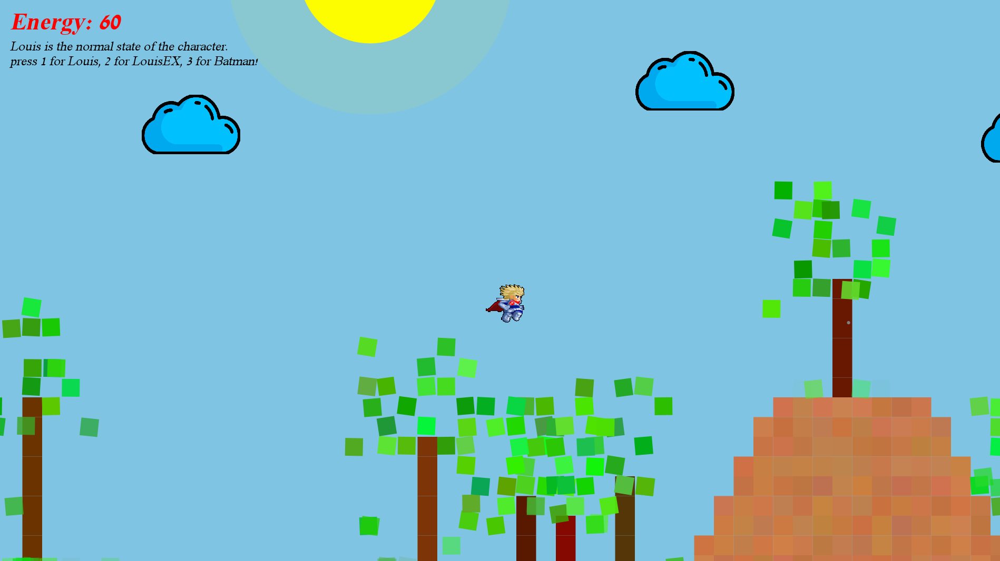

# EX5- Precise Environmental Procedural

The Project was made by Gil Karin and Itamar Shehcter.

## How it looks like:
 
 
  
  
  
   
 
## A little bit about the design:

### Infinite World
In order to make the world continue to infinity, we keep track of the current limits, left and right, of the
word(trees,leaves, clouds,terrain) that we created this far. 

When the player approches a certian distance from
the end of the current world, we create another section of the word and update the limits fields accordingly.

In order to maintain high efficiency, when the player reaches a sufficient distance from one of the limits of
the world, we delete all the items that are no where near the player, close to the limit
that the player is far away from.

### Trees

We decided to implement the tree package with two classes, one is responsible for tree creation
and leaves creation, and one is for the concrete leaf object. 

We considered building the leaf class as
an inner class inside tree, because each leaf lives inside a tree. but because the leaves have a lot of
functionality, we figured that such move will decrease the readability of our code.

### Dilemmas
As i mentioned before, we considered making the leaf class an inner class inside trees.

Beside that, we considered which responsibility should the tree class have and which the leaf class have.

We decided that the leaf class should be responsible for all its transitions and activate them with creation,
all beside the transition that makes the leaves move on the tree, resembling movement caused by wind.

We figured that that transition is applied only because the leaf is on a tree, so we decided to make a public
function that will make the leaves move and the tree class will call that function.

The implementation of the new figures was a big dilemma, because we didn't want to make new classes for the
bonus, and making the program become less readable or making an Encapsulation of the changing of the
figures (which will make it much harder to add another figure) while having more readable code.

### Bonus
We implemented 2 additional features: the game now has clouds, that the player can rest on and aggregate
energy when resting on them. 

An additional feature is switching creatures, there is the normal creature,
which is nice as it, but there are two more special creatures: on is very fast,it can run and fly faster
than the regular creature. the third creature is batman! it can fly as a bat and it doesn't lose any energy.

The player can switch creatures using the keyboard, as explained on the game screen, click 1 for the regular
creature, click 2 for the faster one, and 3 for batman.
